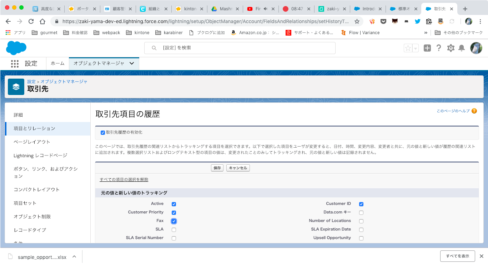
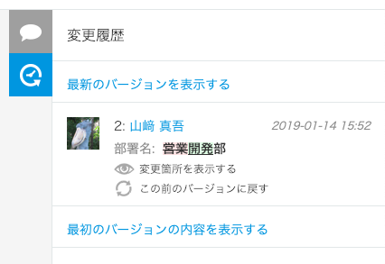

「kintone 認定 アソシエイト 試験対策テキスト」のメモ
====================================================

内容のメモというよりは、主に「Salesforce を知っている人間から見た差分」という感じ

## 第1章 アプリの作成と利用

### 1-1 アプリの作成

- Excel/CSV から読み込み、Salesforce だと最近 (Dreamforce'19) ようやく [Lightning Object Creator](https://www.salesforce.com/blog/2018/09/lightning-object-creator-spreadsheets-into-apps) としてできるようになった
- ユーザー選択フィールドが (システムが決めた) IDでなく (ユーザーが設定した) ログイン名でできるのは良いが、参照関係項目の読み込みには対応してないぽい
    - データローダはすべて ID なので...

### 1-3 コメントや履歴の利用

- デフォルトですべての項目の変更履歴が残るらしい。Salesforce だと項目履歴管理機能でやらないとだめ
    - だし、最大20項目という縛りがある
    - Salesforce も kintone も、オブジェクト/アプリ単位で履歴機能はON/OFFできる

- kintone は特定のバージョンに戻すのが簡単にできる

